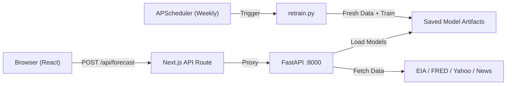
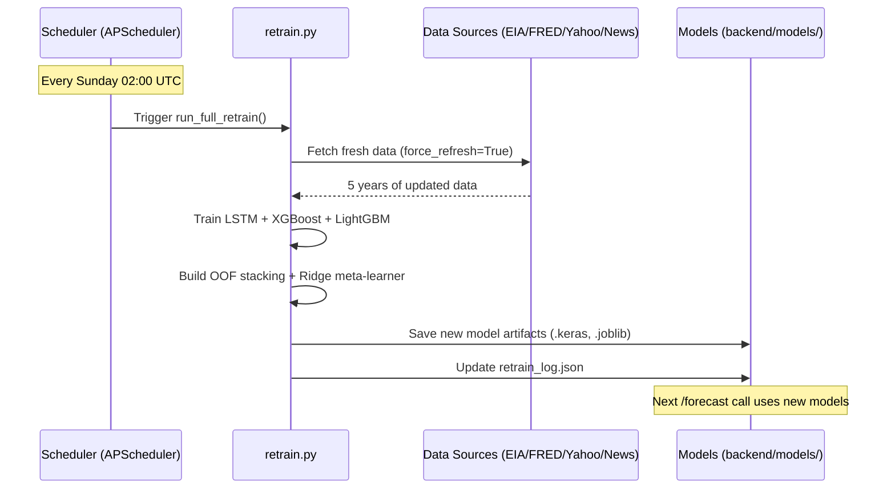

# Walkthrough: Deploying the Crude Oil ML Model

## What Was Done

Your friend's [crudeoil.ipynb](file:///c:/Users/91987/OneDrive/Desktop/CRUDEOIL/my-app/crudeoil.ipynb) (a stacked ensemble: LSTM + XGBoost + LightGBM + Ridge) has been extracted into a **production FastAPI backend** and connected to your **Next.js frontend**.

## Architecture Overview



## Files Created

### Backend (`backend/`)

| File | Purpose |
|------|---------|
| [config.py](file:///c:/Users/91987/OneDrive/Desktop/CRUDEOIL/my-app/backend/config.py) | API keys (from `.env`), constants, hyperparameters |
| [data_ingestion.py](file:///c:/Users/91987/OneDrive/Desktop/CRUDEOIL/my-app/backend/data_ingestion.py) | Fetches data from EIA, FRED, yfinance, NewsAPI with caching |
| [features.py](file:///c:/Users/91987/OneDrive/Desktop/CRUDEOIL/my-app/backend/features.py) | RSI, MACD, Bollinger, ATR, lag/rolling features, supervised views |
| [model.py](file:///c:/Users/91987/OneDrive/Desktop/CRUDEOIL/my-app/backend/model.py) | LSTM/XGBoost/LightGBM training, OOF stacking, save/load, inference |
| [main.py](file:///c:/Users/91987/OneDrive/Desktop/CRUDEOIL/my-app/backend/main.py) | FastAPI app: `/forecast`, `/health`, `/retrain`, `/retrain/status` |
| [retrain.py](file:///c:/Users/91987/OneDrive/Desktop/CRUDEOIL/my-app/backend/retrain.py) | Standalone retraining script (fetches fresh data + trains all 4 experiments) |
| [scheduler.py](file:///c:/Users/91987/OneDrive/Desktop/CRUDEOIL/my-app/backend/scheduler.py) | APScheduler — weekly auto-retrain every Sunday 02:00 UTC |
| [requirements.txt](file:///c:/Users/91987/OneDrive/Desktop/CRUDEOIL/my-app/backend/requirements.txt) | Python dependencies |
| [.env.example](file:///c:/Users/91987/OneDrive/Desktop/CRUDEOIL/my-app/backend/.env.example) | Template for API keys |

### Frontend

| File | Purpose |
|------|---------|
| [route.ts](file:///c:/Users/91987/OneDrive/Desktop/CRUDEOIL/my-app/app/api/forecast/route.ts) | Next.js API route — proxies `/api/forecast` to FastAPI |

---

## How to Run (Step-by-Step)

### Step 1: Set Up the Backend

```bash
cd c:\Users\91987\OneDrive\Desktop\CRUDEOIL\my-app\backend

# Create a .env file with your API keys
copy .env.example .env
# Edit .env and add your EIA_API_KEY, FRED_API_KEY, NEWS_API_KEY

# Create a Python virtual environment
python -m venv venv
venv\Scripts\activate

# Install dependencies
pip install -r requirements.txt
```

### Step 2: Train the Models (First Time Only)

> [!IMPORTANT]
> You must train the models at least once before the `/forecast` endpoint will work. This takes ~10-15 minutes with real API keys.

```bash
cd c:\Users\91987\OneDrive\Desktop\CRUDEOIL\my-app\backend
python retrain.py
```

This will:
1. Fetch 5 years of data from EIA, FRED, Yahoo Finance, and NewsAPI
2. Train 4 experiments: WTI 1-day, WTI 7-day, Brent 1-day, Brent 7-day
3. Save model artifacts to `backend/models/`
4. Write a log to `backend/models/retrain_log.json`

### Step 3: Start the FastAPI Server

```bash
cd c:\Users\91987\OneDrive\Desktop\CRUDEOIL\my-app\backend
python main.py
# Server starts at http://localhost:8000
# Swagger docs at http://localhost:8000/docs
```

### Step 4: Start Next.js (in a second terminal)

```bash
cd c:\Users\91987\OneDrive\Desktop\CRUDEOIL\my-app
npm run dev
# Frontend at http://localhost:3000
```

### Step 5: Test the Pipeline

```bash
# Health check
curl http://localhost:8000/health

# Get a forecast
curl -X POST http://localhost:8000/forecast -H "Content-Type: application/json" -d "{\"symbol\":\"wti\",\"horizon\":7}"

# Trigger manual retrain
curl -X POST http://localhost:8000/retrain

# Check retrain status
curl http://localhost:8000/retrain/status
```

---

## How Auto-Retraining Works



**The scheduler starts automatically** when you run the FastAPI server. You can also trigger retraining manually via `POST /retrain`.

**What gets retrained:** All 4 experiments (WTI×1d, WTI×7d, Brent×1d, Brent×7d). Each experiment trains LSTM, XGBoost, and LightGBM base models, then fits a Ridge meta-learner on out-of-fold predictions.

---

## Data Flow: Notebook → Backend → Frontend

````carousel
### 1. Notebook (crudeoil.ipynb)
Your friend's notebook does everything in sequence:
```
Fetch Data → Feature Engineering → Train Models → Save Artifacts → Predict
```
All inline, not reusable. Can only run in Jupyter/Colab.

<!-- slide -->

### 2. Backend (what we built)
Same logic, split into modules that can run as a **web service**:
```
config.py          → Settings & API keys
data_ingestion.py  → Fetch & cache data
features.py        → Feature engineering
model.py           → Train / load / predict
main.py            → REST API endpoints
retrain.py         → Full retrain pipeline
scheduler.py       → Weekly auto-retrain
```

<!-- slide -->

### 3. Frontend Connection
The Next.js app calls the backend through a **proxy route**:
```
Browser → POST /api/forecast (Next.js) → POST /forecast (FastAPI)
```
The `useForecast` hook in your app already calls `/api/forecast` — it will now hit the real model!
````

> [!NOTE]
> The `backend/cache/` directory stores CSV caches of fetched data. The `backend/models/` directory stores trained model artifacts. Both are created automatically.
